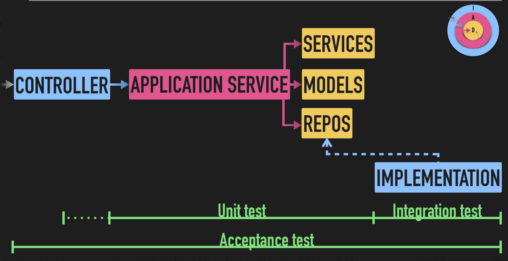

# Technical Evaluation Problem to Solve

You are the developer in charge of building a cash register.

This app will be able to add products to a cart and compute the total price.

## Objective

Build an application responding to these needs.

By application, we mean:
- It can be a simple CLI application
- It is usable while remaining as simple as possible
- It is readable
- It is maintainable
- It is easily extendable

## Technical requirements

- Use any of those languages you are comfortable (Ruby, Python, Go, .Net Core)
- Covered by tests
- Following TDD methodology

## Description

### Assumptions

**Products Registered**
| Product Code | Name | Price |  
|--|--|--|
| GR1 |  Green Tea | 3.11€ |
| SR1 |  Strawberries | 5.00 € |
| CF1 |  Coffee | 11.23 € |

**Special conditions**

- The CEO is a big fan of buy-one-get-one-free offers and green tea.
He wants us to add a  rule to do this.

- The COO, though, likes low prices and wants people buying strawberries to get a price  discount for bulk purchases.
If you buy 3 or more strawberries, the price should drop to 4.50€.

- The VP of Engineering is a coffee addict.
If you buy 3 or more coffees, the price of all coffees should drop to 2/3 of the original price.

Our check-out can scan items in any order, and because the CEO and COO change their minds  often, it needs to be flexible regarding our pricing rules.

**Test data**
| Basket | Total price expected |  
|--|--|
| GR1,GR1 |  3.11€ |
| SR1,SR1,GR1,SR1 |  16.61€ |
| GR1,CF1,SR1,CF1,CF1 |  30.57€ |

**Deliverable**

The codebase in a shared folder we can access to

**Things we are going to look into or ask about**

- Best practices
- Commit history
- Code structure and flow
- Facility To make some changes to the code
- A proper readme with good explanation

## NOTES OF THE AUTHOR OF THIS EXERCISE

1. This exercise has been done for a synchronous infrastructure, which expects to show the result in a command line interface immediately.
2. Also, we can use event_sourcing/event driven architectures as asynchronous alternatives, with Roda, Rack...etc.
3. you can see a video of an exercise with event_sourcing with ruby/eventide in my youtube channel. https://youtu.be/5wRJt9E0oso
4. This image represents the flow on how i understand we need to test any app:

